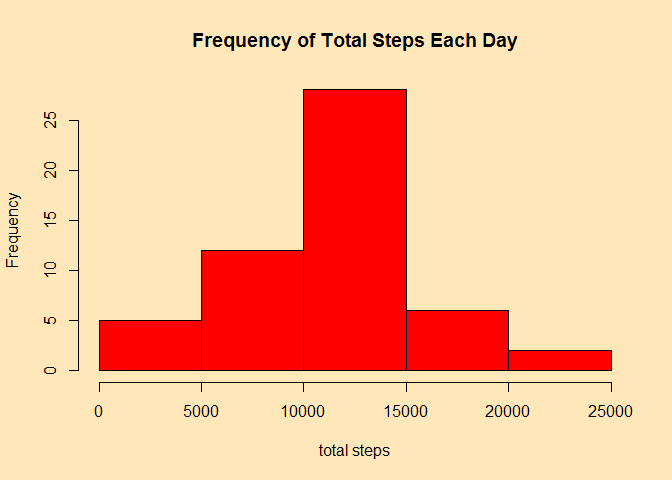
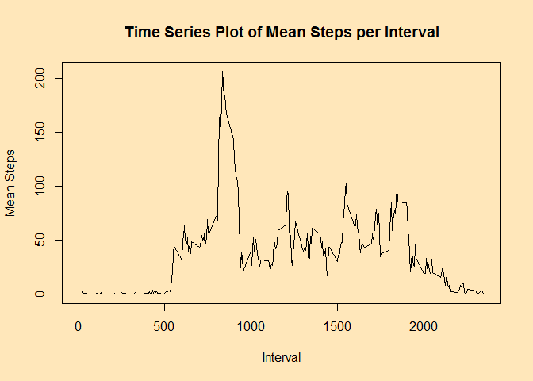
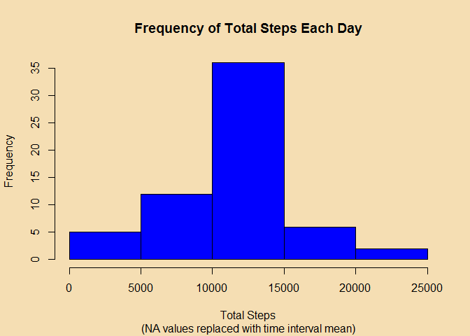
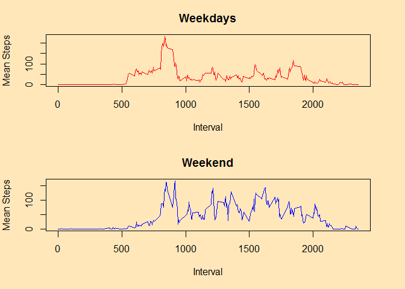

# Reproducible Research: Peer Assessment 1


## Loading and preprocessing the data


### Downloading Data
This chunk checks if the working directory has the required file and if not, downloads and unzips it.

```r
Url <- "https://d396qusza40orc.cloudfront.net/repdata%2Fdata%2Factivity.zip"
activityzip <- "activity.zip"
activityfile <- "activity.csv"

if (!file.exists(activityzip)){
        print("downloading zip file")
        download.file(Url, activityzip)
}
if (!file.exists(activityfile)) { 
        print("unzipping file")
        unzip(activityzip)
} 
```


### Reading data and converting dates
This chunk reads the data and converts date to a date class.

```r
suppressMessages(library(lubridate))
require(lubridate)
rawactivity <- read.csv(activityfile)
rawactivity$date <- ymd(rawactivity$date)
```


## What is mean total number of steps taken per day?


### Total number of steps
This chunk calculates the total steps, omitting NA values.

```r
require(stats)
cleanactivity <- na.omit(rawactivity)
stepsperday <- aggregate(list(total_steps = cleanactivity$steps), list(date = cleanactivity$date), sum)
```


### Histogram with omitted NA values
This chunk plots a histogram of frequency of steps

```r
par(bg = "wheat1")
hist(stepsperday$total_steps, col = "red", main = "Frequency of Total Steps Each Day", xlab = "total steps")
```

 


### Mean and median of steps
This chunk calculates the mean and median values of steps and alters scientific notation to standard notation for ease of comparison

```r
options(scipen = 100)
stepsmean <- mean(stepsperday$total_steps)
stepsmedian <- median(stepsperday$total_steps)
```

**The mean number of steps per day is 10766.1886792**
**The median number of steps per day is 10765**


## What is the average daily activity pattern?


### Times series plot of interval and mean steps
This chunk finds the mean number of steps taken per interval and then plots a time series graph.

```r
stepsperinterval <- aggregate(list(mean_steps = cleanactivity$steps), list(interval = cleanactivity$interval), mean)

par(bg = "wheat1")
plot(stepsperinterval$mean_steps ~ stepsperinterval$interval, type = "l", xlab = "Interval", ylab = "Mean Steps", main = "Time Series Plot of Mean Steps per Interval")
```

 


### Finding which interval has the maximum number of steps
This chunk finds the maximum number of steps and which interval it belongs to.

```r
maxsteps <- max(stepsperinterval$mean_steps)
maxinterval <- stepsperinterval[stepsperinterval$mean_steps == maxsteps, 1]
```

**Time interval, 835, contains the maximum number of steps, 206.1698113.**


## Imputing missing values


### Missing total
This chunk finds the total amount of missing values

```r
missingsum <- sum(as.numeric(is.na(rawactivity)))
```

**There are 2304 missing (NA) values in the dataset.**


### Replacing NA values and saving as a new dataset
This chunk saves the old dataset as a new dataset and then replaces its NA values with the mean value of each time interval.

```r
newactivity <- rawactivity

newactivity$steps <- ifelse(is.na(newactivity$steps), stepsperinterval$mean_steps[stepsperinterval$interval %in% newactivity$interval], newactivity$steps)
```


### Plotting a new histogram and finding mean and median
This chunk first creates a new dataframe consisting of total steps taken per day. It then creates a histogram from this data.

```r
newsteps <- aggregate(list(total_steps = newactivity$steps), list(date = newactivity$date), sum)

par(bg = "wheat")
hist(newsteps$total_steps, col = "blue", xlab = "Total Steps", main = "Frequency of Total Steps Each Day", sub = "(NA values replaced with time interval mean)" )
```

 


This last part of the chunk calculates the mean and median of the revised data.

```r
newmean <- mean(newsteps$total_steps)
newmedian <- median(newsteps$total_steps)
```

**The new mean is 10766.1886792 and the new median is 10766.1886792.**
**Imputing missing values with mean values caused the new mean and median to become identical, because instead of being removed, they added more data to the "center" of the data distribution.** 


## Are there differences in activity patterns between weekdays and weekends?


### Creating weekday and weekend factors
This chunk adds a new column, "weekday_weekend", containing factors which tell whether the day is a weekday or in the weekend.

```r
newactivity["weekday_weekend"] <- factor(weekdays(newactivity$date))

levels(newactivity$weekday_weekend) <- list(weekday = c("Monday", "Tuesday", "Wednesday", "Thursday", "Friday"), weekend = c("Saturday", "Sunday"))
```


### Panel plot
This chunk creates subsets of data based on whether they are labeled weekday or weekend. It then creates separate time series plots for these data and displays them in a panel plot.

```r
weekdaydata <- subset(newactivity, newactivity$weekday_weekend == "weekday")

weekdaymean <- aggregate(list(mean_steps = weekdaydata$steps), list(interval = weekdaydata$interval), mean)

weekenddata <- subset(newactivity, newactivity$weekday_weekend == "weekend")

weekendmean <- aggregate(list(mean_steps = weekenddata$steps), list(interval = weekenddata$interval), mean)

par(mfrow = c(2,1), mar = c(5, 4, 3, 3), bg = "wheat1")

plot(weekdaymean$interval, weekdaymean$mean_steps, main = "Weekdays", type = "l", xlab = "Interval", ylab = "Mean Steps", col = "red")

plot(weekendmean$interval, weekendmean$mean_steps, main = "Weekend", type = "l", xlab = "Interval", ylab = "Mean Steps", col = "blue")
```

 
